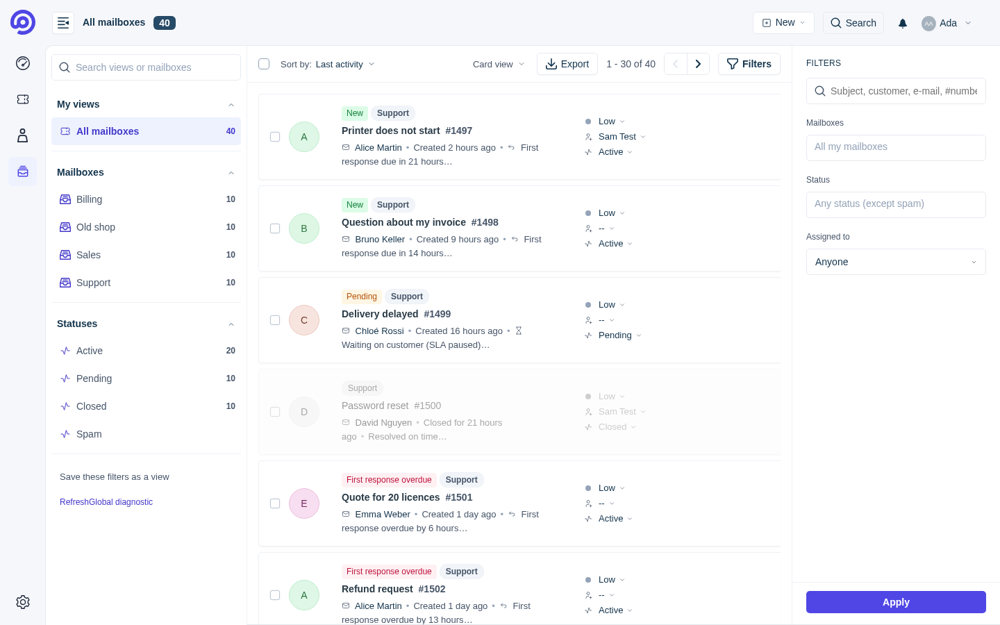

# RefreshGlobal — "All mailboxes" for FreeScout

> **Repository**: https://github.com/00MY00/RefreshGlobal

[Version française](README.md)

## 1. Overview

RefreshGlobal is a [FreeScout](https://freescout.net) module that adds an **"All mailboxes"** page: the tickets of
every mailbox you can access, in one list, with a mailbox filter. Tickets stay in their mailbox: a click opens the
normal ticket page, so replies are sent from the right mailbox address. When the
[Refresh](https://github.com/altmenorg/freescout-refresh) module is installed, the page looks exactly like it;
otherwise it uses FreeScout's standard look.



## 2. Features

- **"All mailboxes" page** (`/refresh-global/tickets`), in FreeScout's menu and in Refresh's left bar.
- **Mailbox filter** (several at once), **status**, **assignee** (me, unassigned, an agent).
- **Search**: subject, customer name, e-mail, ticket number (`#123`).
- **Mailbox above each ticket**: name and address of the mailbox (badge in card view, pill on phones, column in
  table view); can be hidden in the settings.
- **Refresh's "My dashboard" over all mailboxes**: Refresh alone shows the first mailbox only; the module shows the
  same dashboard (same look) with the figures and tickets of all the user's mailboxes. Tiles lead to "All mailboxes"
  filtered on the matching Refresh view.
- **Deleting a ticket**: back to "All mailboxes" with the last filters (or the next ticket of that list); trash
  (default) or permanent deletion.
- With Refresh: **"All mailboxes" phone tab**, option to replace Refresh's "Tickets" entry, automatic update with
  rollback.
- **Counters** per mailbox and per status (grouped queries).
- **CSV export** of the filtered list (UTF-8 with BOM for Excel, capped number of rows).
- **Personal saved views**: save filters, rename, set a default view, delete.
- Filters live in the URL: a filtered list can be shared and the Back button works.
- **Access rights enforced**: users only see, count and export tickets of their own mailboxes (and only their own
  tickets with the "see only assigned conversations" permission).
- **Compatibility diagnostic**: `php artisan refreshglobal:check` and an admin page, with explicit `RG-xxx` messages
  after a FreeScout or Refresh update.
- Languages: English, French, German, Spanish, Italian, Dutch, Brazilian Portuguese.
- **Language**: the module follows FreeScout's language, like Refresh (which has no language choice of its own): the
  user's profile language, otherwise the default one. A **language switch** at the bottom of the views panel (and
  of the phone drawer) changes that profile language: FreeScout, Refresh and the module switch together.

## 3. What it does not do

- It **does not modify** Refresh or FreeScout (no core or Refresh file is changed, copied or replaced).
- It **moves no ticket**: each ticket stays in its mailbox.
- It **does not handle replies**: they happen on the normal ticket page, from the right mailbox address.

## 4. Requirements

| | Tested | Supported |
|---|---|---|
| FreeScout | 1.8.245 | 1.8.x (warning otherwise) |
| Refresh (optional) | 1.4.3 | 1.4.x (warning otherwise); without Refresh: FreeScout's standard look |
| PHP | 8.2 | 7.1+ (like FreeScout) |
| Database | MariaDB 10.11 | FreeScout's (MySQL/MariaDB; PostgreSQL supported by the code but not tested) |
| Installer OS | Debian 12, Ubuntu 24.04 | Linux with bash; full install: Ubuntu / Debian |

Details: [COMPATIBILITY.md](COMPATIBILITY.md). **Windows**: not supported by FreeScout's official documentation, so
there is no PowerShell installer; use the manual installation.

## 5. Quick install

Add to an existing FreeScout (one command):

```bash
curl -fsSL https://raw.githubusercontent.com/00MY00/RefreshGlobal/main/install.sh | sudo bash
```

Full install on a blank Ubuntu/Debian server (runs FreeScout's official installer, then RefreshGlobal; Refresh too
if you give its official archive):

```bash
curl -fsSL https://raw.githubusercontent.com/00MY00/RefreshGlobal/main/install.sh | sudo bash -s -- --full [--refresh-zip=/root/Refresh.zip]
```

Reading the script before running it (the commands above pipe it straight into `bash`):

```bash
sudo git clone https://github.com/00MY00/RefreshGlobal.git /opt/RefreshGlobal
less /opt/RefreshGlobal/install.sh
sudo bash /opt/RefreshGlobal/install.sh --dry-run --source=/opt/RefreshGlobal/RefreshGlobal   # shows every action, changes nothing
sudo bash /opt/RefreshGlobal/install.sh --source=/opt/RefreshGlobal/RefreshGlobal
```

Updates: `sudo git -C /opt/RefreshGlobal pull`, then the same command with `--update`. Without Git: download
`RefreshGlobal.zip`, `install.sh` and `SHA256SUMS` from the Releases page, `sha256sum -c SHA256SUMS --ignore-missing`, then
`sudo bash install.sh --source=RefreshGlobal.zip`; or unzip into FreeScout's `Modules/` folder,
`chown -R www-data:www-data Modules/RefreshGlobal` and activate it in **Manage › Modules** (no backup or rollback then).

## 6. After installing

- Menu **"All mailboxes"**, or `https://your-helpdesk/refresh-global/tickets`.
- Check: `cd /var/www/html && sudo -u www-data php artisan refreshglobal:check` (exit code 0 OK, 1 degraded, 2 blocking).
- Admin diagnostic page: `https://your-helpdesk/refresh-global/diagnostic`.
- Settings: **Manage › Settings › RefreshGlobal** (admins).

| Setting | Default | Effect |
|---|---|---|
| "Tickets" entry | off | replaces Refresh's "Tickets" entry by "All mailboxes" |
| Dashboard of all mailboxes | on | Refresh's "My dashboard" covers all the user's mailboxes |
| Mailbox above each ticket | on | name and address of the mailbox above the subject (list and dashboard) |
| Go to the next ticket | off | after a deletion: off = back to "All mailboxes" (last filters), on = next ticket of that list |
| Automatic refresh | 30 seconds | the list and the dashboard refresh themselves when their tickets change (never while typing, selecting or with a menu open); 0 = off |
| Keep my place in the list | on | after a deletion (from the ticket or from the list), "All mailboxes" opens where you were, the next ticket in place of the deleted one |
| Delete permanently | off | off = FreeScout's trash (can be restored); on = the ticket and its e-mails are removed from FreeScout at once (cannot be undone; the mail server is not touched) |
| Also on the mail server | on | when a ticket is deleted for good, its e-mails are moved to the mail server's trash folder (IMAP) within a minute, still restorable from the webmail; trash folder found automatically or set by hand |
| Empty automatically (trash) | 0 days = never | every day at 03:45, tickets in the trash for more than N days are deleted for good with their e-mails (all mailboxes; mail server untouched) |
| Automatic update | off | daily safe update with automatic rollback |

**Empty the trash now**: "Empty the trash (N)" button in these settings and at the bottom of the "All mailboxes" views
panel (phones too), with confirmation; same rules as FreeScout's own "Empty trash" (admins or users allowed to delete
conversations, their mailboxes only). Cannot be undone. CLI: `php artisan refreshglobal:trash --older-than=30`.

Buttons below the settings: **"Check for updates"** (tells at once whether a newer version exists, installs nothing)
and **"Update now"** (safe update started within a minute).

With Refresh in French, the module also corrects two of Refresh's phone strings ("Créé 7h il y a" → "Créé il y a
7h") without modifying Refresh: see `RefreshGlobal/Resources/lang/refresh-fixes.php`.

## 7. Updating

```bash
curl -fsSL https://raw.githubusercontent.com/00MY00/RefreshGlobal/main/install.sh | sudo bash -s -- --update
```

New versions come from the latest GitHub *release* (archive + `SHA256SUMS`). **When no release is published**, the
module and `install.sh` use the **current version of the `main` branch** (a `git push` is enough); there is no
checksum file for a branch, so integrity relies on HTTPS, and the post-install checks with automatic rollback still
apply. As soon as a release exists, it is used instead.

After every Refresh or FreeScout update: 1. `php artisan refreshglobal:check`, 2. read the report, 3. fix the failed
items (usually: install the RefreshGlobal release made for the new version).

## 8. Uninstall and rollback

```bash
… | sudo bash -s -- --uninstall    # disables the module, offers to drop its table and files, touches nothing else
… | sudo bash -s -- --rollback     # restores the module files and its table from the last backup
```

Backups: `/var/backups/refreshglobal/<date>/` (root only). Log: `/var/log/refreshglobal-install.log` (no passwords).

## 9. Troubleshooting

See the `RG-xxx` table in the [French README](README.md#9-dépannage); every message states what was expected, the
effect and the action to take.

## 10. Security

Rights are enforced server-side by a single query for the list, counters and export; mailbox ids from the URL are
intersected with the mailboxes FreeScout allows. State-changing actions use POST/DELETE with a CSRF token. CSV
formulas are neutralised. **Read the script before running it** (or use `--dry-run`); it only downloads this
repository's archive (SHA-256 checked) and, with `--full`, FreeScout's official installer — never Refresh.

## 11. Contributing, license, changelog

[docs/CONTRIBUTING.md](docs/CONTRIBUTING.md) · [GNU AGPL v3](LICENSE) (same license as FreeScout and Refresh) ·
[CHANGELOG.md](CHANGELOG.md) · [tests/RESULTS.md](tests/RESULTS.md)
