# RefreshGlobal — « Toutes les boîtes » pour FreeScout

> **Dépôt** : https://github.com/00MY00/RefreshGlobal

[English version](README.en.md)

## 1. Présentation

RefreshGlobal est un module pour [FreeScout](https://freescout.net) qui ajoute une page **« Toutes les boîtes »** :
les tickets de toutes les boîtes auxquelles vous avez accès, dans une seule liste, avec un filtre par boîte.
Les tickets restent dans leur boîte : un clic ouvre la page normale du ticket, et la réponse part donc avec
l'adresse de la bonne boîte. Si le module [Refresh](https://github.com/altmenorg/freescout-refresh) est installé,
la page a exactement son apparence ; sinon elle utilise le style standard de FreeScout.


| Filtres par boîte et statut | Vue tableau |
|---|---|
| 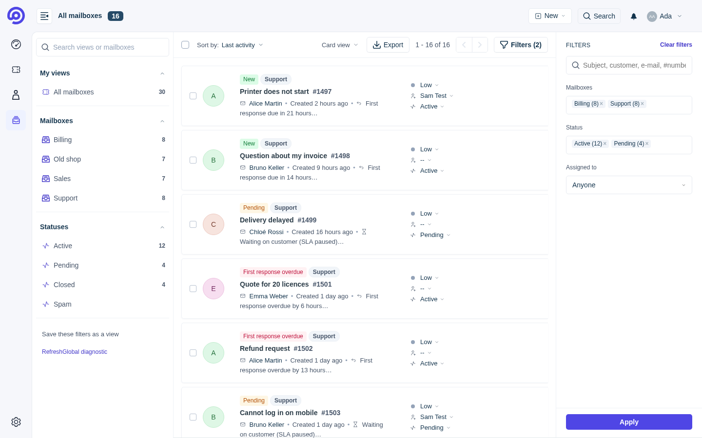 | 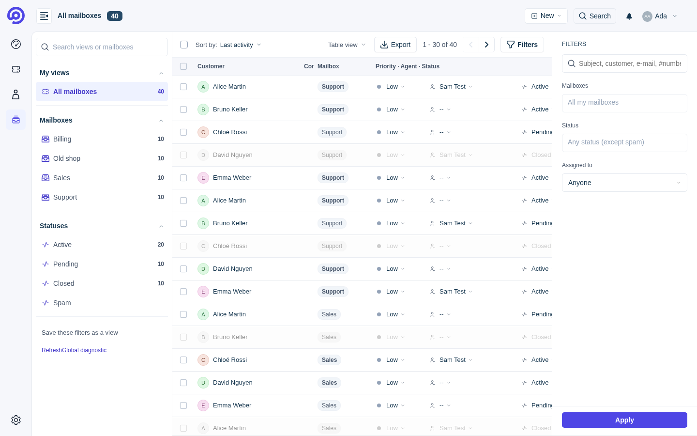 |

Sur téléphone (avec Refresh) : l'entrée « Toutes les boîtes » en tête du tiroir des vues (☰), la liste, et le tiroir de la page (boîtes, statuts, export, vues enregistrées).

| Tiroir de Refresh | Liste | Tiroir de la page |
|---|---|---|
| 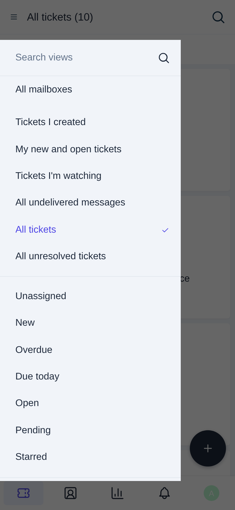 | 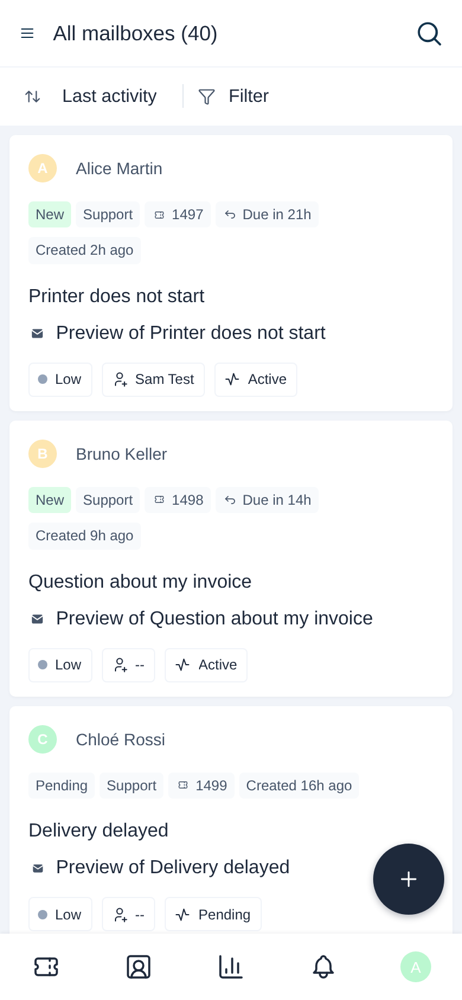 | 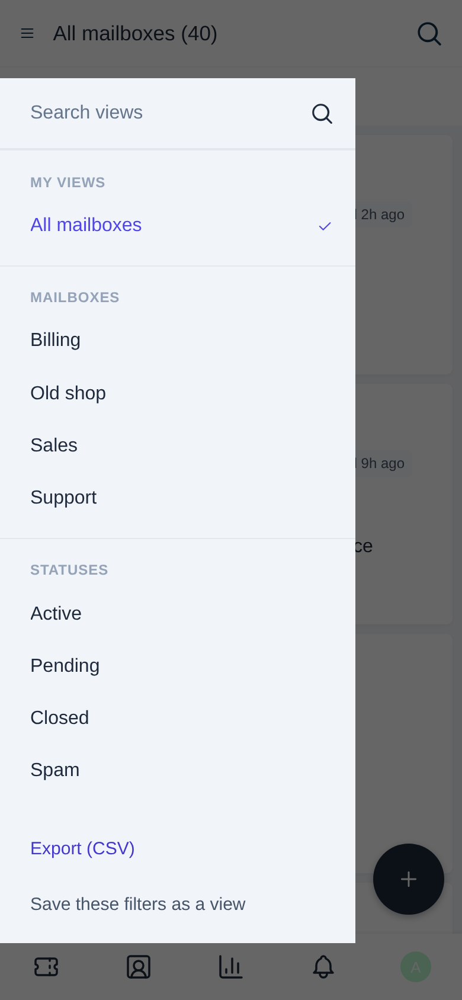 |

Dans Gérer › Modules :

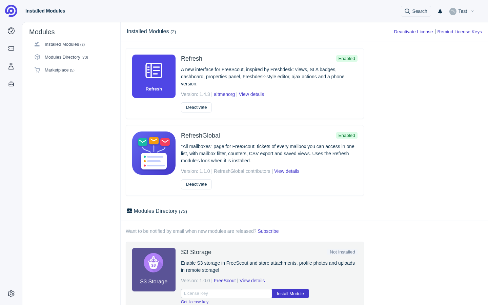

## 2. Fonctionnalités

- **Page « Toutes les boîtes »** (`/refresh-global/tickets`), dans le menu de FreeScout, dans la barre de gauche de Refresh et, sur téléphone, en tête du tiroir des vues (☰).
- **Filtre par boîte** (plusieurs boîtes à la fois), **statut**, **assignation** (moi, non assigné, un agent).
- **Recherche** : sujet, nom du client, e-mail, numéro de ticket (`#123`).
- **Boîte au-dessus de chaque ticket** : nom et adresse de la boîte (badge en vue cartes, pastille sur téléphone,
  colonne en vue tableau) ; peut être masquée dans les réglages.
- **« Mon tableau de bord » de Refresh sur toutes les boîtes** : Refresh seul n'affiche que la première boîte ; le
  module affiche le même tableau de bord (même présentation) avec les chiffres et les tickets de toutes les boîtes de
  l'utilisateur. Les tuiles mènent à « Toutes les boîtes », filtrée sur la vue Refresh correspondante.
- **Suppression d'un ticket** : retour à « Toutes les boîtes » avec les derniers filtres (ou ticket suivant de cette
  liste) ; au choix corbeille (par défaut) ou suppression définitive.
- **Compteurs** par boîte et par statut, calculés en une requête groupée.
- **Export CSV** de la liste filtrée (UTF-8 avec BOM pour Excel, nombre de lignes plafonné).
- **Vues enregistrées** personnelles : enregistrer les filtres, renommer, définir une vue par défaut, supprimer.
- Filtres dans l'adresse : un lien filtré se partage et le bouton « Retour » fonctionne.
- **Respect des droits** : chacun ne voit, ne compte et n'exporte que les tickets de ses boîtes (et seulement ses
  tickets s'il a la permission « ne voir que les conversations assignées »).
- Sur téléphone (avec Refresh) : **onglet « Toutes les boîtes »** dans la barre du bas.
- **Option « Remplacer l'entrée Tickets de Refresh »** : l'entrée « Tickets » de Refresh est masquée dans la barre de
  gauche et la barre du bas, « Toutes les boîtes » prend sa place.
- **Mise à jour automatique** (facultative) avec **retour arrière automatique** si la nouvelle version ne fonctionne pas.
- **Diagnostic de compatibilité** : `php artisan refreshglobal:check` et page d'administration, avec des messages
  explicites (codes `RG-xxx`) après une mise à jour de FreeScout ou de Refresh.
- Traductions : français, anglais, allemand, espagnol, italien, néerlandais, portugais (Brésil).

## 3. Ce que le module ne fait pas

- Il **ne modifie pas** Refresh ni FreeScout (aucun fichier du cœur ou de Refresh n'est touché, copié ou remplacé).
- Il **ne déplace aucun ticket** : chaque ticket reste dans sa boîte d'origine.
- Il **ne gère pas les réponses** : elles se font sur la page normale du ticket, avec l'adresse de la bonne boîte.

## 4. Prérequis

| | Testé | Pris en charge |
|---|---|---|
| FreeScout | 1.8.245 | 1.8.x (avertissement en dehors) |
| Refresh (facultatif) | 1.4.3 | 1.4.x (avertissement en dehors) ; sans Refresh : style FreeScout standard |
| PHP | 8.2 | 7.1 et plus (comme FreeScout) |
| Base de données | MariaDB 10.11, MySQL 8 (installation complète) | celles de FreeScout (MySQL/MariaDB, PostgreSQL) |
| Système (installeur) | Debian 12, Ubuntu 24.04 | Linux avec bash ; installation complète : Ubuntu / Debian |

Détails et points d'intégration fragiles : [COMPATIBILITY.md](COMPATIBILITY.md).

**Windows** : la documentation officielle de FreeScout ne prend pas Windows en charge (« there is no any tutorial
yet »). Il n'y a donc pas d'installeur `install.ps1` ; sous Windows, utilisez l'installation manuelle (section 5.3).

## 5. Installation rapide

### 5.1 Ajouter le module à un FreeScout existant (une commande)

Sur le serveur FreeScout, en SSH :

```bash
curl -fsSL https://raw.githubusercontent.com/00MY00/RefreshGlobal/main/install.sh | sudo bash
```

Le script trouve FreeScout (sinon : `… | sudo bash -s -- --path=/var/www/html`), sauvegarde la base et le module,
télécharge la dernière version, l'active, vérifie la compatibilité et affiche un résumé :

```
[1/7] Contrôles préalables... OK — FreeScout 1.8.245, Refresh 1.4.3, utilisateur web www-data
[2/7] Téléchargement de RefreshGlobal (dernière version)... version 1.0.0
[3/7] Sauvegarde (base de données et module)... /var/backups/refreshglobal/20261009-140102
[4/7] Copie dans Modules/RefreshGlobal... OK
[5/7] Activation du module (migrations, lien public, caches)... OK
[6/7] Vérification de compatibilité... OK
[7/7] Résumé... OK
```

### 5.2 Installation complète sur un serveur vierge (une commande)

Sur un serveur Ubuntu ou Debian neuf, avec un nom de domaine pointant vers lui :

```bash
curl -fsSL https://raw.githubusercontent.com/00MY00/RefreshGlobal/main/install.sh | sudo bash -s -- --full
```

Le script lance **le script officiel de FreeScout** (il pose ses propres questions : domaine, confirmations
d'installation des paquets, dossier, HTTPS — sur un serveur neuf, répondre `Y` à « All files in /var/www/html will
be removed » : ce dossier ne contient que la page par défaut de nginx), vous demande de terminer l'installation
dans le navigateur (adresse `/install`), puis installe RefreshGlobal.
Pour installer aussi Refresh, téléchargez d'abord son archive officielle
([Refresh.zip](https://github.com/altmenorg/freescout-refresh/releases/latest/download/Refresh.zip)) puis :

```bash
curl -fsSL https://raw.githubusercontent.com/00MY00/RefreshGlobal/main/install.sh | sudo bash -s -- --full --refresh-zip=/root/Refresh.zip
```

Sans `--refresh-zip`, RefreshGlobal fonctionne avec le style FreeScout standard (et le dit clairement).

### 5.3 Installation sans exécuter un script téléchargé à l'aveugle

Les commandes des sections 5.1 et 5.2 envoient le script directement à `bash`. Pour **lire avant d'exécuter**,
trois méthodes :

**a) Avec Git** (recommandé : `git pull` suffit ensuite pour les mises à jour)

```bash
sudo git clone https://github.com/00MY00/RefreshGlobal.git /opt/RefreshGlobal
less /opt/RefreshGlobal/install.sh                                   # lire le script
sudo bash /opt/RefreshGlobal/install.sh --dry-run --source=/opt/RefreshGlobal/RefreshGlobal   # voir les actions, sans rien faire
sudo bash /opt/RefreshGlobal/install.sh --source=/opt/RefreshGlobal/RefreshGlobal             # installer
```

Mise à jour : `sudo git -C /opt/RefreshGlobal pull` puis
`sudo bash /opt/RefreshGlobal/install.sh --update --source=/opt/RefreshGlobal/RefreshGlobal`.

**b) Avec les fichiers de la publication** (page *Releases* du dépôt, téléchargés dans le navigateur puis copiés
sur le serveur, par exemple avec `scp`) : `RefreshGlobal.zip`, `install.sh` et `SHA256SUMS`, dans le même dossier :

```bash
sha256sum -c SHA256SUMS --ignore-missing    # RefreshGlobal.zip et install.sh doivent être « OK »
less install.sh
sudo bash install.sh --source=RefreshGlobal.zip
```

**c) Entièrement à la main**, comme pour tout module FreeScout (wiki FreeScout, « FreeScout Modules »), avec
`RefreshGlobal.zip` :

```bash
cd /var/www/html                       # dossier de FreeScout
sudo unzip ~/RefreshGlobal.zip -d Modules/
sudo chown -R www-data:www-data Modules/RefreshGlobal
```

puis **Gérer › Modules › RefreshGlobal › Activer** dans FreeScout (ou
`sudo -u www-data php artisan module:enable RefreshGlobal && sudo -u www-data php artisan freescout:module-install refreshglobal`).
Sans l'installeur, il n'y a ni sauvegarde automatique ni retour arrière.

## 6. Après l'installation

- La page : menu **« Toutes les boîtes »** (avec Refresh : icône dans la barre de gauche), ou directement
  `https://votre-helpdesk/refresh-global/tickets`.
- Vérifier que tout fonctionne :
  ```bash
  cd /var/www/html && sudo -u www-data php artisan refreshglobal:check
  ```
  Code de sortie : 0 = OK (ou avertissement), 1 = dégradé, 2 = bloquant.
- Page de diagnostic (administrateurs) : `https://votre-helpdesk/refresh-global/diagnostic`.

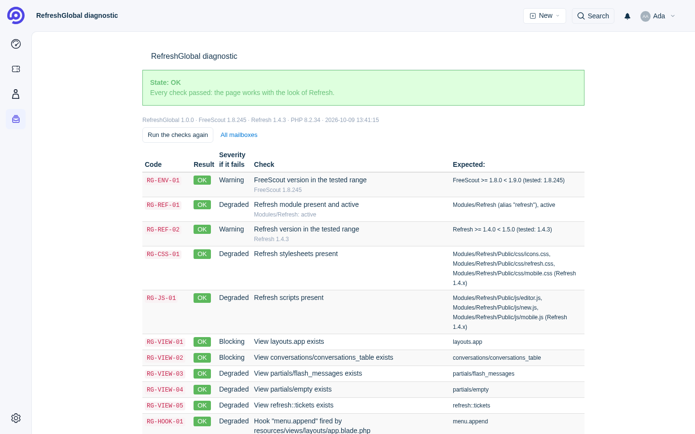

| Onglet ajouté | « Tickets » remplacé |
|---|---|
| 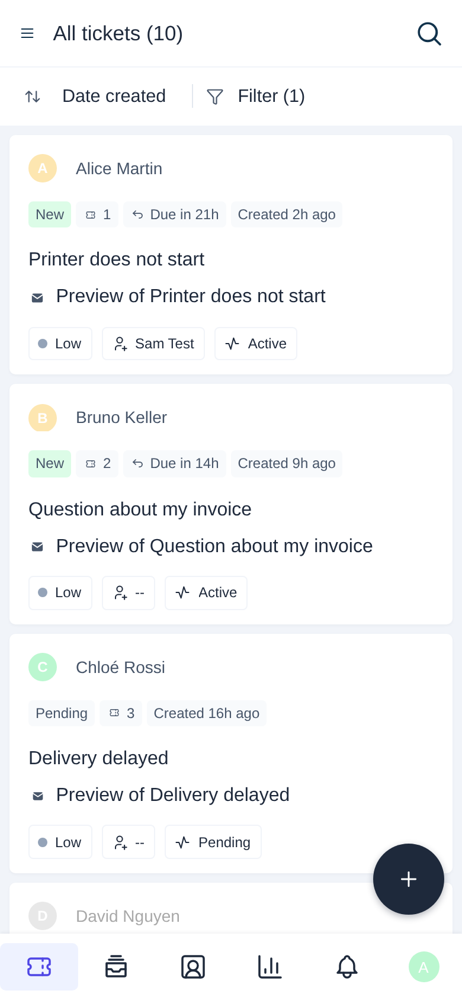 | 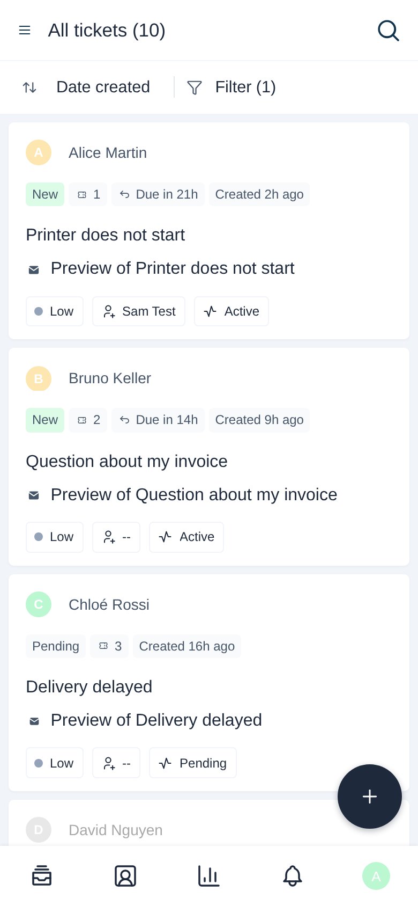 |

**Réglages du module** : **Gérer › Paramètres › RefreshGlobal** (administrateurs).

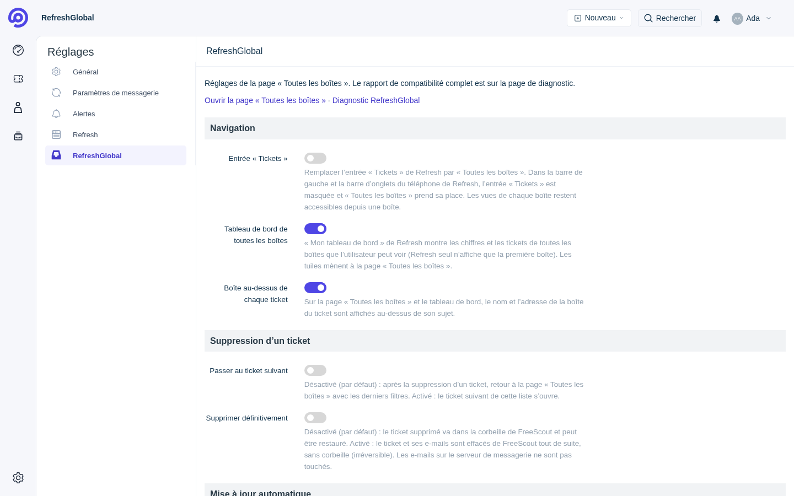

| Réglage | Par défaut | Effet |
|---|---|---|
| Entrée « Tickets » | désactivé | remplace l'entrée « Tickets » de Refresh par « Toutes les boîtes » |
| Tableau de bord de toutes les boîtes | activé | « Mon tableau de bord » de Refresh couvre toutes les boîtes de l'utilisateur |
| Boîte au-dessus de chaque ticket | activé | nom et adresse de la boîte au-dessus du sujet (liste et tableau de bord) |
| Passer au ticket suivant | désactivé | après une suppression : désactivé = retour à « Toutes les boîtes » (derniers filtres), activé = ticket suivant de cette liste |
| Supprimer définitivement | désactivé | désactivé = corbeille de FreeScout (restaurable) ; activé = le ticket et ses e-mails sont effacés de FreeScout tout de suite (irréversible ; rien n'est touché sur le serveur de messagerie) |
| Mise à jour automatique | désactivé | voir § 7 |

Boutons sous les réglages : **« Rechercher une mise à jour »** (indique tout de suite si une version plus récente
existe, sans rien installer) et **« Mettre à jour maintenant »** (mise à jour sécurisée lancée dans la minute).

| Tableau de bord (toutes les boîtes) | Sur téléphone |
|---|---|
| 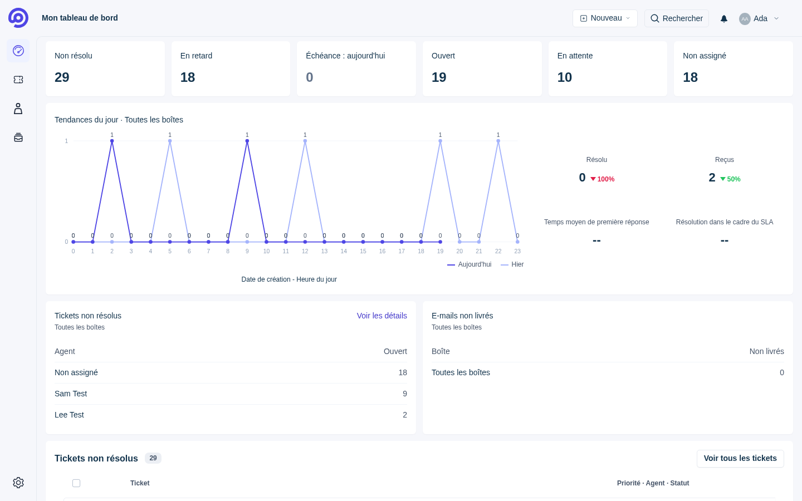 | 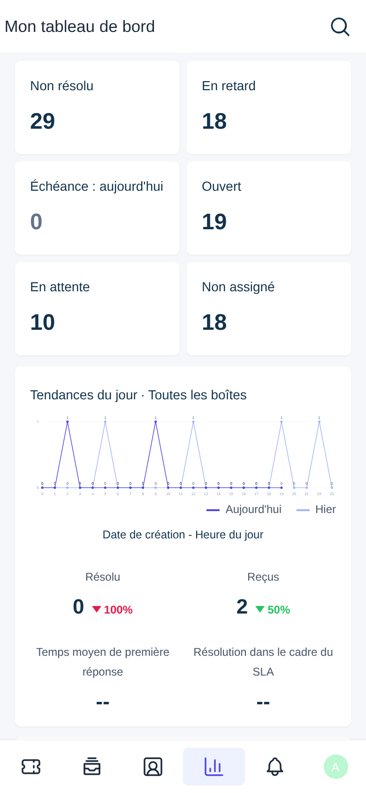 |

**Ne garder que « Toutes les boîtes »** (avec Refresh) : Gérer › Paramètres › RefreshGlobal › *Navigation*, ou page
de diagnostic › *Navigation* › « Activer ». L'entrée
« Tickets » de Refresh est alors masquée (barre de gauche et barre du bas du téléphone) et remplacée par
« Toutes les boîtes ». Les vues de chaque boîte restent accessibles depuis une boîte ; rien n'est modifié dans
Refresh, « Désactiver » remet l'entrée.

Réglages facultatifs dans le `.env` de FreeScout (puis `php artisan freescout:clear-cache`) :
`REFRESHGLOBAL_PER_PAGE` (30), `REFRESHGLOBAL_EXPORT_MAX_ROWS` (5000), `REFRESHGLOBAL_CSV_DELIMITER` (`;`),
`REFRESHGLOBAL_COMPAT_CACHE_MINUTES` (5), `REFRESHGLOBAL_MAX_SAVED_VIEWS` (50). Valeurs par défaut des réglages
avant le premier enregistrement : `REFRESHGLOBAL_GLOBAL_DASHBOARD` (true), `REFRESHGLOBAL_SHOW_MAILBOX` (true),
`REFRESHGLOBAL_AFTER_DELETE` (`list` ou `next`), `REFRESHGLOBAL_DELETE_PERMANENTLY` (false).

Avec Refresh en français, le module corrige aussi deux textes de Refresh sur téléphone (« Créé 7h il y a » →
« Créé il y a 7h », idem pour « Fermé ») sans modifier Refresh : voir `RefreshGlobal/Resources/lang/refresh-fixes.php`.

## 7. Mise à jour

**Mettre à jour RefreshGlobal** (les vues enregistrées sont conservées) :

```bash
curl -fsSL https://raw.githubusercontent.com/00MY00/RefreshGlobal/main/install.sh | sudo bash -s -- --update
```

(`--version=1.2.3` pour une version précise.)

### Mise à jour automatique (avec retour arrière)

Désactivée par défaut. Une fois activée, le module vérifie chaque jour (à 03:30) s'il existe une nouvelle version
publiée sur GitHub et l'installe en sécurité :

1. téléchargement de l'archive et vérification de son empreinte SHA-256 (refusée si elle ne correspond pas) ;
2. sauvegarde du module, des vues enregistrées et de la liste de ses migrations ;
3. installation (comme Gérer › Modules) puis contrôles : `refreshglobal:check` et affichage réel de la page pour un
   administrateur (`refreshglobal:selftest`) ;
4. **si quelque chose ne va pas** (installation en erreur, état bloquant ou plus mauvais qu'avant, page qui ne
   s'affiche pas) : **retour automatique à la version précédente** (fichiers, vues enregistrées, nouvelles tables
   annulées). Cette version n'est plus retentée automatiquement, et un bandeau prévient les administrateurs.

Activer ou désactiver :
- **Gérer › Paramètres › RefreshGlobal** (administrateurs) : case « Mise à jour automatique », versions installée et
  disponible, dernier résultat, et bouton **« Mettre à jour maintenant »** (la mise à jour sécurisée est lancée dans
  la minute par le planificateur, jamais pendant le chargement de la page) ;
- **page de diagnostic** (`/refresh-global/diagnostic`) : mêmes boutons ;
- ou `cd /var/www/html && sudo -u www-data php artisan refreshglobal:update --enable` (`--disable`) ;
- ou à l'installation : `… | sudo bash -s -- --auto-update=on`.

Elle passe par le cron de FreeScout (`php artisan schedule:run`, installé par le script officiel). Mise à jour à la
main avec les mêmes garanties : `sudo -u www-data php artisan refreshglobal:update` (`--check` pour seulement
vérifier). Heure : `REFRESHGLOBAL_AUTO_UPDATE_TIME=03:30` dans le `.env`. Le bouton « Mettre à jour » de Gérer ›
Modules n'est volontairement pas utilisé (il ne sait pas revenir en arrière). `install.sh --update` revient lui
aussi automatiquement à la version précédente si la nouvelle est bloquante (`--no-auto-rollback` pour l'empêcher).

**Après chaque mise à jour de Refresh ou de FreeScout** :

1. `cd /var/www/html && sudo -u www-data php artisan refreshglobal:check`
2. lire le rapport : chaque ligne en échec donne son code, ce qui était attendu, l'effet et l'action à faire ;
3. corriger les points en échec (le plus souvent : installer la version de RefreshGlobal prévue pour la nouvelle
   version, voir [COMPATIBILITY.md](COMPATIBILITY.md)).

Tant qu'un point est en échec, la page reste sûre : style standard (état « dégradé ») ou liste masquée avec des
liens vers les boîtes (état « bloquant »).

## 8. Désinstallation et retour arrière

```bash
# désactiver le module (propose de supprimer sa table et ses fichiers ; rien d'autre n'est touché)
curl -fsSL https://raw.githubusercontent.com/00MY00/RefreshGlobal/main/install.sh | sudo bash -s -- --uninstall

# revenir à l'état d'avant la dernière installation / mise à jour
curl -fsSL https://raw.githubusercontent.com/00MY00/RefreshGlobal/main/install.sh | sudo bash -s -- --rollback
```

- Mode non interactif : `--yes` (la table est alors **conservée**, sauf `--drop-tables` ; les fichiers aussi, sauf `--remove-files`).
- Sans le script : **Gérer › Modules › RefreshGlobal › Désactiver**. Désactiver le module ne casse rien ; sa seule
  table (`refreshglobal_saved_views`) se supprime avec `php artisan module:migrate-rollback RefreshGlobal --force`.
- Sauvegardes : `/var/backups/refreshglobal/<date>/` (lisibles par root seulement) ; `--rollback=<date>` pour en
  choisir une. Le retour arrière restaure les fichiers du module et sa table, jamais toute la base (les tickets
  reçus entre-temps sont conservés) ; la sauvegarde complète `database.sql.gz` reste disponible pour une
  restauration manuelle.
- Journal : `/var/log/refreshglobal-install.log` (aucun mot de passe n'y est écrit).

## 9. Dépannage

| Code | Gravité | Cause | Solution |
|---|---|---|---|
| RG-ENV-01 | avertissement | version de FreeScout hors de la plage testée | vérifier COMPATIBILITY.md, mettre à jour RefreshGlobal |
| RG-REF-01 | dégradé | Refresh absent ou désactivé | installer / activer Refresh, ou garder le style standard |
| RG-REF-02 | avertissement | version de Refresh hors de la plage testée | vérifier COMPATIBILITY.md |
| RG-CSS-01 | dégradé | feuilles de style de Refresh introuvables (Refresh a changé) | vérifier la version de Refresh, mettre à jour RefreshGlobal |
| RG-JS-01 | dégradé | scripts de Refresh introuvables | idem |
| RG-VIEW-01…04 | bloquant / dégradé | une vue de FreeScout a disparu | mettre à jour RefreshGlobal |
| RG-VIEW-05 | dégradé | la page liste de Refresh a changé | mettre à jour RefreshGlobal |
| RG-HOOK-01…17 | dégradé | un hook n'est plus déclenché (menu, colonne « Boîte », icône, entrée de la barre latérale, onglet téléphone, réglages) | mettre à jour RefreshGlobal ; la liste fonctionne |
| RG-HOOK-18…20, RG-CORE-09…11 | dégradé | tableau de bord de FreeScout ou de Refresh changé | le tableau de bord de Refresh s'affiche tel quel (première boîte) ; mettre à jour RefreshGlobal |
| RG-HOOK-21, RG-ROUTE-04, RG-CORE-12 | dégradé | suppression d'un ticket de FreeScout changée | la suppression garde le comportement de FreeScout ; mettre à jour RefreshGlobal |
| RG-HOOK-22 | avertissement | dictionnaire des textes de Refresh changé | certains textes de Refresh sur téléphone gardent leur tournure d'origine |
| RG-CORE-01…06 | bloquant | classe / méthode / constante de FreeScout absente | mettre à jour RefreshGlobal |
| RG-CORE-07, 08 | dégradé | classes nécessaires à la mise à jour automatique absentes | la liste fonctionne ; mise à jour automatique désactivée |
| RG-ROUTE-01…03 | bloquant | route introuvable | `php artisan freescout:clear-cache`, sinon mettre à jour |
| RG-DB-01…04 | bloquant | table ou colonne de FreeScout absente | `php artisan migrate` |
| RG-DB-05 | dégradé | table des vues enregistrées absente | `php artisan migrate` (les vues enregistrées sont désactivées en attendant) |
| RG-ACL-01, RG-ACL-02 | bloquant | règles d'accès de FreeScout indisponibles | mettre à jour RefreshGlobal |
| RG-ERR-01 | bloquant | erreur inattendue en construisant la page | lire `storage/logs/laravel.log` (le code y figure) |
| RG-ERR-02 | bloquant | un contrôle de compatibilité a planté | lire `storage/logs/laravel.log` |
| RG-ERR-03 | — | erreur en construisant le tableau de bord de toutes les boîtes | celui de Refresh s'affiche à la place ; lire `storage/logs/laravel.log` |
| RG-ERR-04 | — | erreur en préparant la redirection après une suppression | FreeScout redirige comme d'habitude ; lire `storage/logs/laravel.log` |

Exemples des deux états :

| Dégradé (Refresh désactivé) | Bloquant (route manquante simulée) |
|---|---|
| 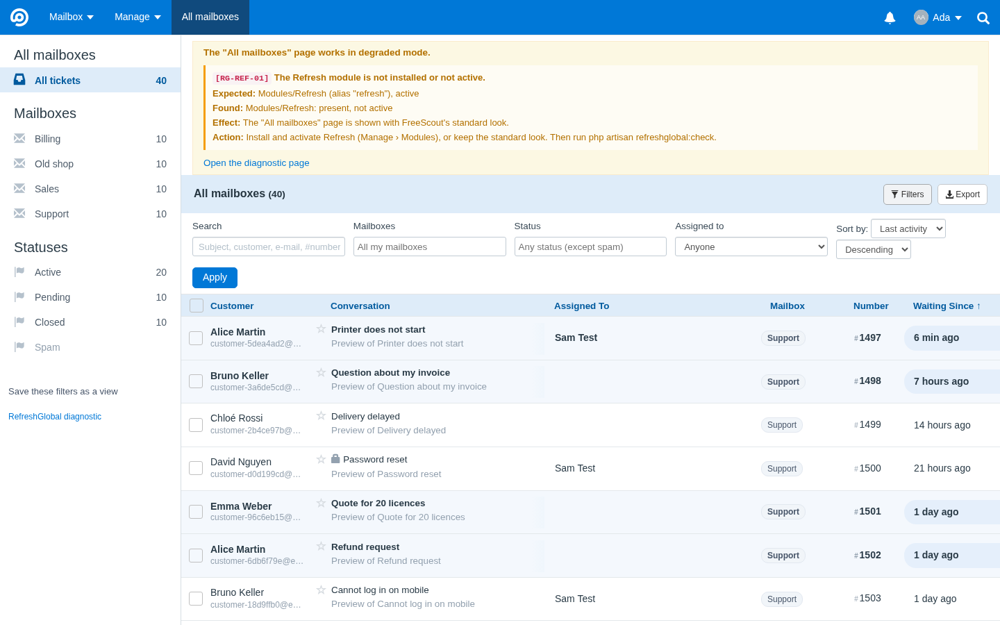 | 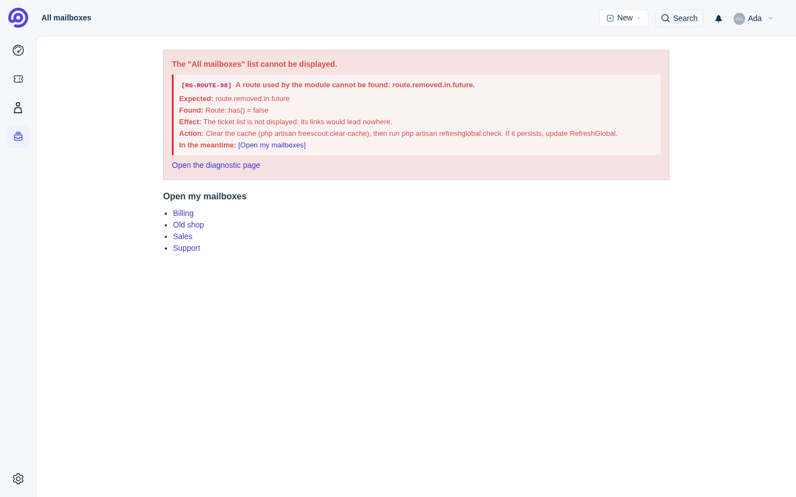 |

Problèmes d'installation : le message indique l'étape en échec, la cause et la commande de retour arrière ; le
détail est dans `/var/log/refreshglobal-install.log`.

## 10. Sécurité

- Les droits sont toujours appliqués **côté serveur** par une requête unique (`Services/GlobalTicketQuery.php`)
  pour la liste, les compteurs et l'export ; un identifiant de boîte reçu dans l'adresse n'est jamais pris tel quel
  (il est croisé avec les boîtes autorisées par FreeScout). Les boîtes archivées restent invisibles aux non-admins.
- Toutes les actions qui modifient (vues enregistrées) passent par des formulaires POST/DELETE avec jeton CSRF.
- L'export neutralise les formules (cellules commençant par `=`, `+`, `-`, `@`).
- **Lisez le script avant de l'exécuter** (méthodes de la section 5.3 : clone Git ou fichiers de la publication), ou utilisez
  `--dry-run`. Le script ne télécharge rien d'autre que l'archive de ce dépôt (vérifiée par SHA-256 si
  `SHA256SUMS` est publié) et, en mode `--full`, le script officiel de FreeScout ; il ne télécharge jamais Refresh.
- Signaler une faille : ouvrir un ticket privé (« Security advisory ») sur le dépôt.

## 11. Contribuer, licence, changelog

- **Contribuer** : voir [docs/CONTRIBUTING.md](docs/CONTRIBUTING.md) (structure, tests, publication).
  Les points d'intégration avec FreeScout et Refresh sont décrits dans
  [RefreshGlobal/INTEGRATION_MAP.md](RefreshGlobal/INTEGRATION_MAP.md) ; tout nouvel élément utilisé doit y être
  ajouté **et** dans `RefreshGlobal/Config/integration.php` (il sera alors contrôlé par `refreshglobal:check`).
- **Licence** : [GNU AGPL v3](LICENSE). FreeScout est sous AGPL-3.0 (`composer.json`) et Refresh aussi ; un module
  qui s'exécute dans FreeScout et utilise son code doit rester compatible : l'AGPL-3.0 est la même licence, sans
  restriction supplémentaire. Si vous proposez RefreshGlobal modifié à des utilisateurs via le réseau, vous devez leur
  donner accès à son code source.
- **Changelog** : [CHANGELOG.md](CHANGELOG.md).
- Tests : [tests/RESULTS.md](tests/RESULTS.md).

RefreshGlobal n'est ni affilié ni approuvé par FreeScout ou par l'auteur de Refresh.
